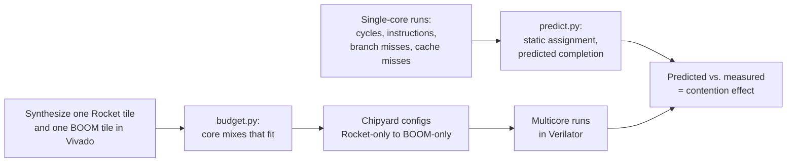

# Heterogeneous RISC-V Multicore Under a Fixed Resource Budget

How should a fixed FPGA budget be split between small in-order cores and large
out-of-order cores, and how does the best split depend on the workload?

This project builds Chipyard SoCs that mix **Rocket** (small, in-order) and
**BOOM** (large, out-of-order) RISC-V cores, from Rocket-only through mixed
"big.LITTLE"-style designs to BOOM-only, all at the same LUT budget, and
compares how quickly each finishes branch-heavy, memory-heavy and balanced
workloads.

> **Status: early development (Fall 2026).** SmallBOOM builds and runs in the
> course Chipyard environment. Budget and prediction scripts are working on
> example data; configs and workloads are starter code. See [Plan](#plan).

## Why this question

An out-of-order core can speed up some programs significantly, but it costs
several times the area of an in-order core and helps little when a program is
waiting on memory. For a designer with a fixed budget, the question is not
which core is faster, but which combination of cores gets the most work done
for the area. Chipyard lets us answer this with real RTL cores instead of an
analytical model.

## Method



1. **Area.** Synthesize one Rocket tile and one BOOM tile; their LUT counts set
   the budget and the core counts for every mix (`scripts/budget.py`).
2. **Single-core characterization.** Run each task alone on Rocket and on BOOM
   and record cycles, instructions, branch mispredictions and cache misses.
   This gives each task's BOOM speedup and the reason for it.
3. **Prediction.** For each core mix and workload mix, assign tasks statically
   and predict completion time from the single-core data (`scripts/predict.py`).
4. **Measurement.** Run the real multicore system in Verilator. The gap between
   predicted and measured time shows how much shared-memory contention matters.
5. **Extension.** Repeat with Medium BOOM to test whether a larger big core is
   worth its area compared with more Rocket cores.

**Metrics:** time to finish each workload mix; throughput per thousand LUTs;
IPC; BOOM speedup per task. All cores run at the same clock.

## Hypotheses

- Branch-heavy mixes favor more BOOM cores.
- Memory-heavy mixes favor more Rocket cores, though contention may limit the
  benefit of adding cores.
- Balanced mixes favor a heterogeneous design over both homogeneous ones.
- Single-core predictions will be least accurate for memory-heavy mixes.

## Repository layout

```
configs/      Chipyard configs: Rocket-only, mixes, BOOM-only (counts set from budget.py)
workloads/    Task list and the static-assignment multicore program
scripts/      budget.py (core mixes under a LUT budget), predict.py (completion-time prediction)
data/         Measured single-core results (example file until real runs)
results/      Multicore run outputs
docs/         Proposal, figures, report
```

## Quick start

```bash
# Core mixes that fit a budget (use your synthesis numbers)
python scripts/budget.py --rocket-luts <R> --boom-luts <B> --budget <LUTs>

# Predicted completion time per mix, proposal policy vs. load-balancing policy
python scripts/predict.py data/single_core_EXAMPLE.csv --mixes 0:4 1:2 2:0
```

Building the SoCs: copy `configs/HeteroBudgetConfigs.scala` into the course's
`student-work/` directory, match the core fragments to the course's Chipyard
version (see the comments at the top of the file), then build and run with the
course's usual Verilator flow.

## Plan

| Dates | Milestone | Owner |
| --- | --- | --- |
| Oct 2 to 11 | Enable performance counters; test Medium BOOM build | Lucius |
| Oct 2 to 11 | Select and port tasks | Ben |
| Oct 12 to 25 | Vivado synthesis; set budget and core counts | Lucius |
| Oct 12 to 25 | Single-core characterization | Ben |
| Oct 26 to Nov 8 | Build all core-mix configurations | Lucius |
| Oct 26 to Nov 8 | Multicore test harness, prediction scripts | Ben |
| Nov 9 to 22 | All experiments, Medium BOOM sweep | Both |
| Nov 23 to Dec 4 | Analysis and final report | Both |

## Team

Lucius Casertano and Ben Bohan. Graduate computer architecture course project,
University of Arizona (Fall 2026).

## References

1. R. Kumar et al., "Single-ISA Heterogeneous Multi-Core Architectures for Multithreaded Workload Performance," ISCA 2004.
2. M. D. Hill and M. R. Marty, "Amdahl's Law in the Multicore Era," IEEE Computer, 2008.
3. K. Van Craeynest et al., "Scheduling Heterogeneous Multi-Cores through Performance Impact Estimation (PIE)," ISCA 2012.
4. J. Zhao et al., "SonicBOOM: The 3rd Generation Berkeley Out-of-Order Machine," CARRV 2020.
5. A. Amid et al., "Chipyard: Integrated Design, Simulation, and Implementation Framework for Custom SoCs," IEEE Micro, 2020.
